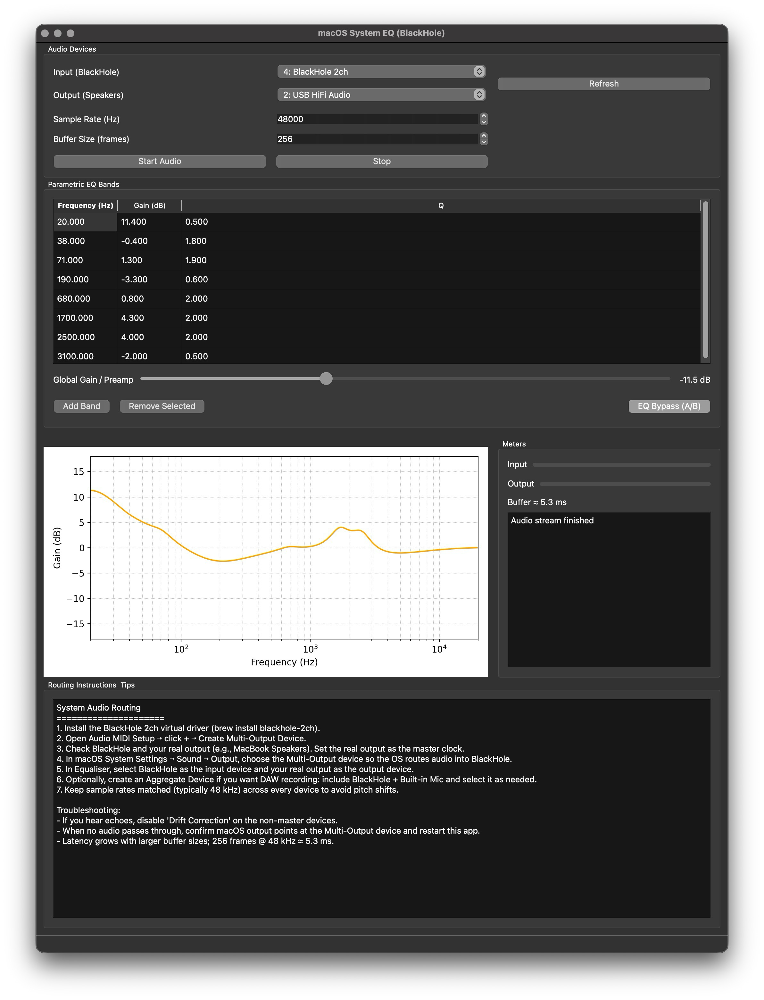

<p align="center">
  
</p>

<h1 align="center">Systemwide Equaliser</h1>

<p align="center">
Parametric EQ that sits between your system audio and your speakers.<br>
macOS doesn't have one built in, so here we are.
</p>



> Built with LLMs. Public domain. Do whatever you want with it (at your own risk).

## Install

You need [Homebrew](https://brew.sh), then:

```bash
brew install blackhole-2ch portaudio python@3.13
git clone https://github.com/raaghava-p/SystemwideEQ-MacOS.git
cd SystemwideEQ-MacOS
python3 -m venv .venv && source .venv/bin/activate
pip install -r requirements.txt && pip install -e .
python -m equaliser
```

**One thing** — PyQt6 6.8+ is broken on Apple Silicon. The requirements
file already pins it to <6.8 so you shouldn't hit this, but if you do:
`pip install "PyQt6>=6.5,<6.8" "PyQt6-Qt6>=6.5,<6.8"`.

## Route Your Audio

The app needs to intercept system audio. [BlackHole](https://github.com/ExistentialAudio/BlackHole) makes this possible but you have to wire it up once:

1. **Audio MIDI Setup** → `+` → Create Multi-Output Device
2. Check **BlackHole 2ch** and your speakers/headphones
3. Physical device = master clock, drift correction on for BlackHole
4. **System Settings → Sound → Output** → select the Multi-Output Device

After that, all system audio goes through BlackHole and the app can process it.

## Use It

1. Set BlackHole as input, your speakers as output
2. Match the sample rate to Audio MIDI Setup (48 kHz is usually right)
3. Start audio
4. Add EQ bands — five filter types available: peaking, low shelf, high shelf, high pass, low pass
5. Toggle individual bands on/off with the checkbox column
6. Preamp slider gives you ±12 dB of headroom
7. A/B bypass to compare
8. Import [AutoEQ](https://github.com/jaakkopasanen/AutoEq) headphone profiles (ParametricEQ.txt)
9. Save presets — last session restores automatically

The spectrum analyzer overlays live frequency content on the EQ curve.
Peak hold markers on the meters show recent maximums.

<details>
<summary>Troubleshooting</summary>

| Problem | Fix |
|---|---|
| No sound | System output probably isn't set to the Multi-Output Device |
| Missing device | Hit Refresh. Might need to `brew install blackhole-2ch` again. |
| Pops/latency | Lower buffer size or make sure sample rates match everywhere |
| Clipping | Turn down band gains or the preamp |
| cocoa plugin error | PyQt6 too new. Pin to <6.8. |
| Broken after moving folder | Venv has stale paths. Nuke it: `rm -rf .venv` and redo setup. |
| Permission error | Terminal needs mic access — System Settings → Privacy & Security |

</details>

<details>
<summary>Build standalone app</summary>

```bash
pip install -r requirements-dev.txt
python scripts/build_app.py py2app
```

Gives you `dist/Equaliser.app`. Drag it to Applications.

</details>

<details>
<summary>Limitations</summary>

- Stereo only
- Swap devices = stop and restart the stream

</details>

<p align="center"><sub><a href="LICENSE">Unlicense</a></sub></p>
